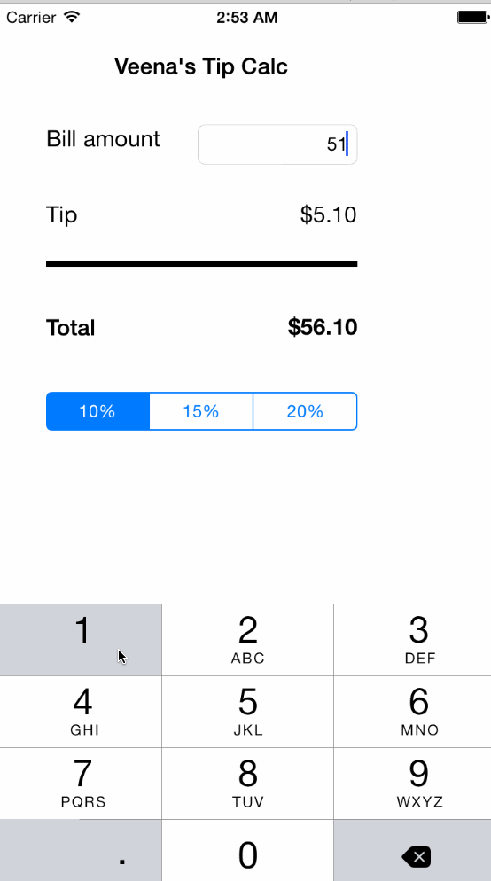

# Swift Tip Calculator
Because sometimes a TODO list is too hard as a first app, here's a tip calculator!

## What is this

This is an implementation of the Swift tip calculator built by following [tutorial video](http://vimeo.com/102084767) published by CodePath.

Time spent: 1.5 hours

Completed stories:

 * [x] Required: Calculates tip value based on the user input
 * [ ] Required: A settings button displays information about the app
 * [ ] Optional: User can set a default tip value from settings

## What's different

- Converting text to double value is done using the NSString instead of Objective-C bridge.[reference](http://stackoverflow.com/questions/24031621/swift-how-to-convert-string-to-double)
- Refactored the tip computation into a separate function and reusing it on change of both the amount and tip percentage.  

## Credit
- GIF created with [LICEcap](http://www.cockos.com/licecap/).
- [@timothy1ee](https://github.com/timothy1ee) for the great [tutorial video](http://vimeo.com/102084767) 

## License

MIT
